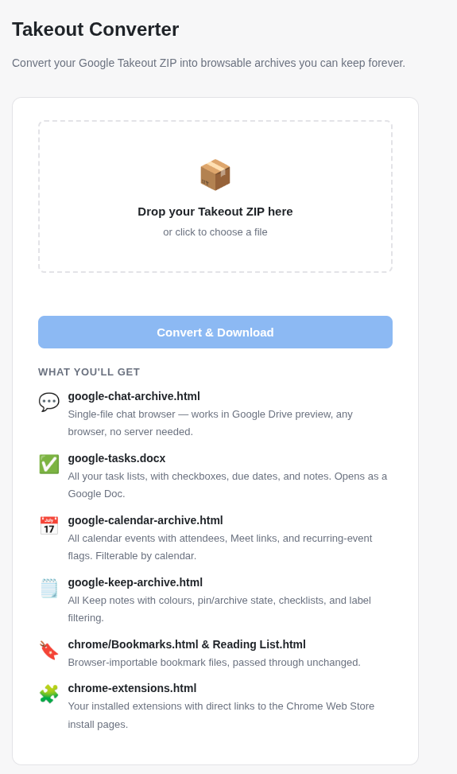

# Takeout Migration

A stateless Flask web app that converts a [Google Takeout](https://takeout.google.com) ZIP export into
human-readable archives you can keep forever — without any accounts, databases,
or cloud services involved.

I know there are a load of these tools.
Since Google changes the formats over time, there are varying degrees of success with any of them.
This one was written and test for the formats around May 2026.
No garuantees.



## What it produces

| Source | Output file(s) | Notes |
|---|---|---|
| Google Chat | `google-chat-archive.html` | Single-file SPA; sidebar navigation + full-text search. Works in Google Drive preview. |
| Google Tasks | `google-tasks.docx` | Task lists with checkboxes, due dates, and notes. Active tasks first, then completed. Opens as a Google Doc. |
| Google Calendar | `google-calendar-archive.html` + `calendar/*.ics` | Events with attendees, Meet links, recurring-event labels. Filterable by calendar. Raw ICS files included for re-import. |
| Google Keep | `google-keep-archive.html` | Notes with colours, pin/archive/trash states, checklists, and label filtering. |
| Chrome Bookmarks | `chrome/Bookmarks.html`, `chrome/Reading List.html` | Passed through unchanged — importable directly into any browser. |
| Chrome Extensions | `chrome-extensions.html` | Lists every installed extension with a direct link to its Chrome Web Store install page. |

The app processes whichever sections are present in your export and skips
the rest, so a partial Takeout is fine.

## Setup

```bash
python3 -m venv .venv
source .venv/bin/activate
pip install -r requirements.txt
```

## Running

```bash
flask run          # http://127.0.0.1:5000
# or
python app.py
```

Open the URL, drop in your Takeout ZIP, and download the result archive.

## Docker

```bash
docker compose up --build
# http://localhost:8000
```

The container runs as a non-root user with a read-only filesystem; all
processing happens in a tmpfs-backed `/tmp`. Worker count scales
automatically with available CPUs (`(2 × CPU) + 1`); override with
`WEB_CONCURRENCY=N` in `docker-compose.yml`.

## Getting a Takeout ZIP

1. Go to [https://takeout.google.com](https://takeout.google.com)
2. Deselect all, then select the products you want:
   **Chat**, **Tasks**, **Calendar**, **Keep**, **Chrome**
3. Export as ZIP and download

You can export multiple products in a single ZIP or run them through
separately — the app handles both.

## Command-line (Chat only)

The chat processor also works as a standalone script that produces a
multi-page static HTML site:

```bash
python google_chat_to_html.py ~/Downloads/Takeout -o ./chat-archive
```

Output layout:

```
chat-archive/
  index.html                    # sortable conversation list
  assets/style.css
  conversations/<slug>.html     # one page per conversation
  files/<slug>/<name>           # copied attachments
```

## Architecture

| Module | Responsibility |
|---|---|
| `app.py` | Flask routes; extracts the upload ZIP in a per-request tempdir, calls each processor, streams back a result ZIP. No state persists between requests. |
| `google_chat_to_html.py` | Parses `group_info.json` / `messages.json`; `render_single_page_html()` builds the SPA with embedded search index; `generate_static_site()` is the CLI path. |
| `tasks.py` | Parses `Tasks.json` (single-file `tasks#taskLists` format); renders DOCX via `python-docx`. |
| `calendar_archive.py` | Parses ICS files with custom line-unfolding; handles RRULE, DATE vs DATETIME, UTC vs floating time; renders a filterable SPA. |
| `keep_archive.py` | Parses per-note JSON files; renders colour-coded masonry card layout with view/label/search filtering. |
| `chrome_archive.py` | Passes `Bookmarks.html` / `Reading List.html` through unchanged; renders `Extensions.json` as an HTML page with Web Store links. |
| `gunicorn.conf.py` | Gunicorn configuration: dynamic worker count, request recycling, stdout logging. |

## Security notes

- Uploaded files are extracted into a `tempfile.TemporaryDirectory` that is
  deleted when the request completes.
- ZIP extraction guards against path-traversal (zip-slip) attacks.
- Flask's `MAX_CONTENT_LENGTH` is set to 500 MB.
- The app carries no session state and writes nothing to disk permanently.
- The Docker image runs as a non-root user on a read-only filesystem.
